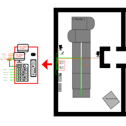

 Video Streaming - Ansible Setup
====================================
Ansible Setup for the VOC *(Video Operation Center)* from the [Toolbox Bodensee e.V.](https://toolbox-bodensee.de).

Ansible is a radically simple IT automation engine that automates cloud provisioning, configuration management, application deployment, intra-service orchestration, and many other IT needs. [Weitere Infos](https://de.wikipedia.org/wiki/Ansible) | [Learn more](https://www.ansible.com/overview/how-ansible-works)

 Usage:
-------
This git repository contains git submodules. To see our complete setup you have to clone them too!
You need [git-lfs](https://git-lfs.github.com/) to clone all parts of this repository!

```
# Clone the Git with submodules
git clone --recursive https://github.com/ToolboxBodensee/toolbox-voc_ansible.git
git submodule update --init --recursive
```


 Playbooks:
------------
+ ``site.yml``: Setup voctocore ans obs on video encoder pc.

 Setup
-------
Here is a graphical overview how everything is connected in the toolbox:



### Hardware we Use
 + [INVENTORY.md](https://github.com/ToolboxBodensee/toolbox-voc_ansible/blob/master/INVENTORY.md)

### How to prepare the Hardware
 + [PREPERATION.md](https://github.com/ToolboxBodensee/toolbox-voc_ansible/blob/master/PREPERATION.md)
 
